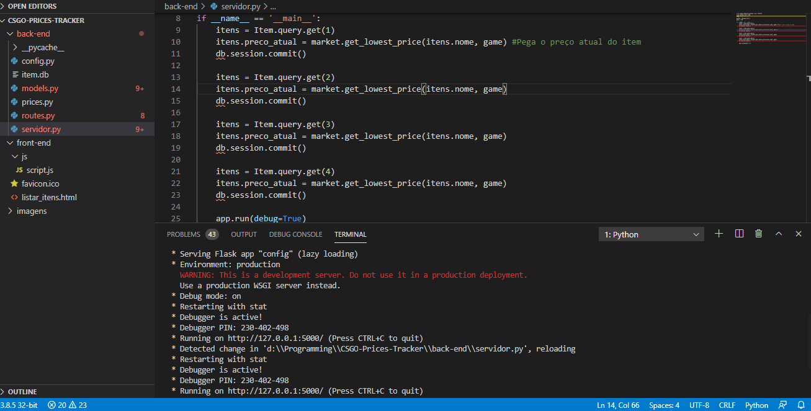

# CS:GO Prices Tracker

Aplicação Web em Python desenvolvida para cadastrar skins de CS:GO e retornar o valor atual da mesma.
Preços retirados do mercado da steam: https://steamcommunity.com/market/search?appid=730

# Coisas para fazer

1. Implementar o cadastro de itens
2. Formatar a data com javascript
3. Descobrir uma forma mais eficiente de pegar o preço dos itens
4. Calcular a diferença do _preço compra_ e _preço atual_

# Imagens

# Imagens da execução

