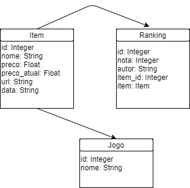

# CS:GO Prices Tracker

Aplicação Web em Python desenvolvida para cadastrar skins de CS:GO e retornar o valor atual da mesma.
Preços retirados do mercado da steam: https://steamcommunity.com/market/search?appid=730

# Imagens

# Imagens da execução

